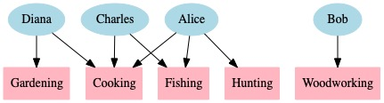

# Skill Discovery (Discord bot)

This little project is a "hack" developed as part of [MetaFest](https://metafest.metagame.wtf) 2021.

### Objective

Create a graphical representation of people skills and interests.

### Why?

To facilitate social bonding and skills exchange:

 * Find someone that has skill S, which you are looking for
 * Find what skills/interests you have in common with person P
 * Get a general feel of the interests within a community

### Examples

Full graph, including all people, all skills/interests and their links:

Word-cloud view of the above:

## Project structure

#### ⚠️ HACK ALERT ⚠️
The source code of this project is **hack-level** quality.

It was stringed together in less than a week.
Please calibrate your expectations accordingly.

For example:

 * ❌ Most of the code is not covered by tests
 * ❌ Code is a hodgepodge of classes, static functions, globals, etc (thanks, Python!)
 * ❌ Some calls are not thread-safe (database, graph rendering, ...)
 * ❌ The data model is as simple as it gets
 * ❌ The rendering is pretty rudimentary
 * etc.

That said, it's in pretty good shape *for a hack*.
Future improvements (if anyone is willing) should be possible incrementally.

### Code overview

...

## Deployment

The bot requires 3 environment variables to run properly.
They can be set on the shell, or in a `.env` file.

`DISCORD_TOKEN`: Token obtained by creating a new discord application.
For examples, see [this guide](https://realpython.com/how-to-make-a-discord-bot-python/) or similar.

`GUILD_ID`: The unique numeric id of the Discord server (a.k.a guild).

`MONITOR_CHANNEL_ID`: The unique numeric ID of the Discord channel to monitor.

The easiest way to learn your server and channel IDs is to open Discord in a browser.
The URL will look like this:

> https://discord.com/channels/<guild id\>/<channel id\>/

### Dependencies

**Python 3.9** and it's dependencies listed in `requirements.txt`.
System (apt package) requirements are listed in requirements.system. Each of these can be installed with `sudo apt install` or equivalent commands.

Using a Python virtual environment is recommended.
Alternatively, using `nix`:

 > nix-shell -p 'python39.withPackages(ps: with ps; [ graphviz python-dotenv discordpy ])'

The `dot` program must be installed (on Linux and macOS, this is part of the `graphviz` package). You can learn more about this format on [Wikipedia](https://en.wikipedia.org/wiki/Graphviz) or on the [official website](https://www.graphviz.org/).

Additional fonts may be necessary to properly display emojis on Linux. Consider installing the `fonts-noto` package. Additional fonts for use with graphviz can also be installed via fontconfig (see https://gist.github.com/jacksonpradolima/840b4a20c617204a65b15da61e124bf6).

A sample installation of dependencies on an Ubuntu distro:

1) `sudo xargs apt install <./requirements.system` installs system requirements (python, graphviz, etc)
2) `python3.9 -m venv ./.venv` creates a virtual environment
3) `source .venv/bin/activate` activates your virtual environment
4) `pip install -r ./requirements.txt` installs all requisite python packages into your virtual environment

### Running locally

Once you have gone through the above steps to creating a new discord app/bot, and have installed necessary depdendencies, you'll want to test the bot locally.

Following the steps below will spin up the bot on your machine, and it'll be listening in the discord server you configured with the `DISCORD_TOKEN`, `GUILD_ID`, and `MONITOR_CHANNEL_ID`. It'll also spin up a SQLite database in the root directory where you're running the bot, to store the skills and users created via the Discord CLI.

The following steps will start the bot on your machine:
1) `source ./.venv/bin/activate`
2) `python3.9 bot.py`

That's it!

### Permissions

To work properly, the bot needs the following permission in the target channel:

 * Read channel messages
 * Write messages to channel
 * React to messages in channel

## License

This project is released under `MIT` license. See the `LICENSE` file for details.
